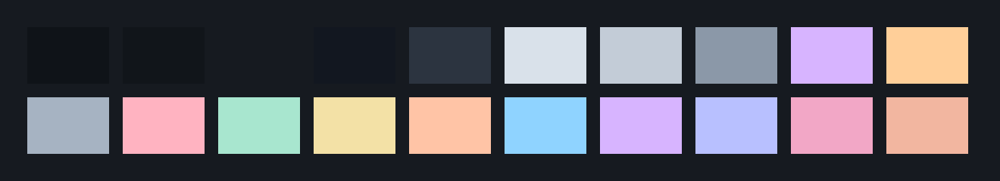
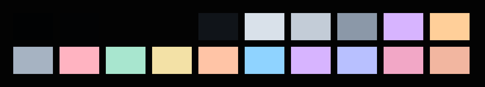
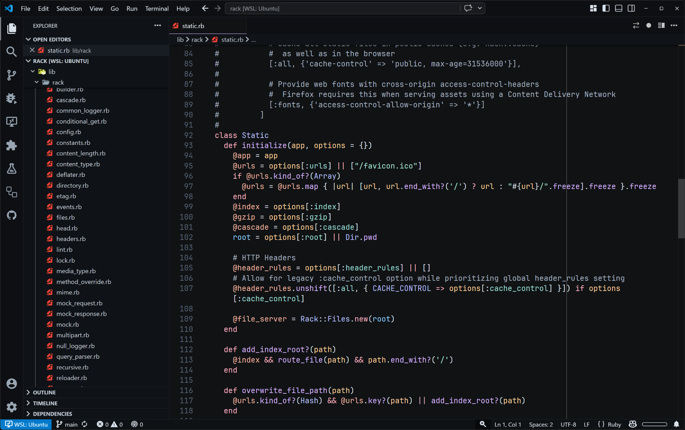

# Sea Cliff Theme

Sea Cliff Theme is a VS Code theme with a blue tinted dark base, high-contrast pastel syntax, and 4 darkness variants. It supports [semantic highlighting](https://github.com/microsoft/vscode/wiki/Semantic-Highlighting-Overview).

## Palette

### Sea Cliff Soft



### Sea Cliff Deep


### Sea Cliff Night


### Sea Cliff Midnight



## Screenshot



The above screenshot is using [JetBrains Mono](https://github.com/JetBrains/JetBrainsMono), [Material Product Icons](https://github.com/material-extensions/vscode-material-product-icons), and the [Material Icon Theme](https://github.com/material-extensions/vscode-material-icon-theme).

## Core UI Palette

| Role           | Soft      | Deep      | Night     | Midnight  |
| -------------- | --------- | --------- | --------- | --------- |
| Chrome         | `#0F1318` | `#0D0F12` | `#0A0C0F` | `#010203` |
| Surface        | `#11151A` | `#0F1216` | `#0C0F12` | `#020304` |
| Editor         | `#161A20` | `#101214` | `#0C0E11` | `#030303` |
| Overlay        | `#121720` | `#101317` | `#0D1013` | `#07090B` |
| Input          | `#121720` | `#101317` | `#0D1013` | `#030303` |
| Border         | `#2C3440` | `#1B2026` | `#171B20` | `#101419` |
| Primary text   | `#D9E1EA` | `#D9E1EA` | `#D9E1EA` | `#D9E1EA` |
| Secondary text | `#C3CCD7` | `#C3CCD7` | `#C3CCD7` | `#C3CCD7` |
| Muted text     | `#8B98A8` | `#8B98A8` | `#8B98A8` | `#8B98A8` |
| Lilac accent   | `#D7B4FF` | `#D7B4FF` | `#D7B4FF` | `#D7B4FF` |
| Peach accent   | `#FFCF99` | `#FFCF99` | `#FFCF99` | `#FFCF99` |

## Shared Syntax Palette

| Token Family                    | Hex       |
| ------------------------------- | --------- |
| Comments                        | `#A6B3C2` |
| Keywords                        | `#FFB3C1` |
| Strings                         | `#A8E6CF` |
| Numbers                         | `#F3E1A6` |
| Types                           | `#FFC4A6` |
| Variables                       | `#8FD3FF` |
| Functions and methods           | `#D7B4FF` |
| Classes and namespaces          | `#B8C0FF` |
| Constants and special variables | `#F2A7C6` |
| Instance variables              | `#F2B6A0` |
| Symbols                         | `#9EDFD6` |
| Regex                           | `#C6E59D` |
| Diff deleted                    | `#FF9F9F` |

## WCAG Contrast

The [Web Content Accessibility Guidelines](https://www.w3.org/WAI/standards-guidelines/wcag) (WCAG) are a set of standards for making web content more accessible to people with disabilities. User Interfaces compliant with WCAG contrast guidelines make text and UI elements more readable for people with low vision, color blindness, aging eyesight, or in challenging viewing conditions.

All four variants meet WCAG 2.2 AAA contrast guidelines for editor text and syntax colors.

The contrast ratios below are calculated from the theme JSON files using WCAG 2.2 contrast math. WCAG contrast compares the relative luminance of foreground and background colors; higher ratios are more readable. See the [WCAG 2.2 distinguishable quick reference](https://www.w3.org/WAI/WCAG22/quickref/#distinguishable) for more details.

| Theme              | Editor Text | Text Level | Lowest Syntax | Syntax Level |
| ------------------ | ----------: | ---------- | ------------: | ------------ |
| Sea Cliff Soft     |   `13.23:1` | AAA        |      `8.19:1` | AAA          |
| Sea Cliff Deep     |   `14.22:1` | AAA        |      `8.80:1` | AAA          |
| Sea Cliff Night    |   `14.64:1` | AAA        |      `9.06:1` | AAA          |
| Sea Cliff Midnight |   `15.62:1` | AAA        |      `9.67:1` | AAA          |

The colors for the UI chrome are designed to remain readable and avoid overly dark text, while borders, selections, and inactive states stay visually quiet.

## Building

```bash
pnpm install
pnpm generate:readme
pnpm package
```
